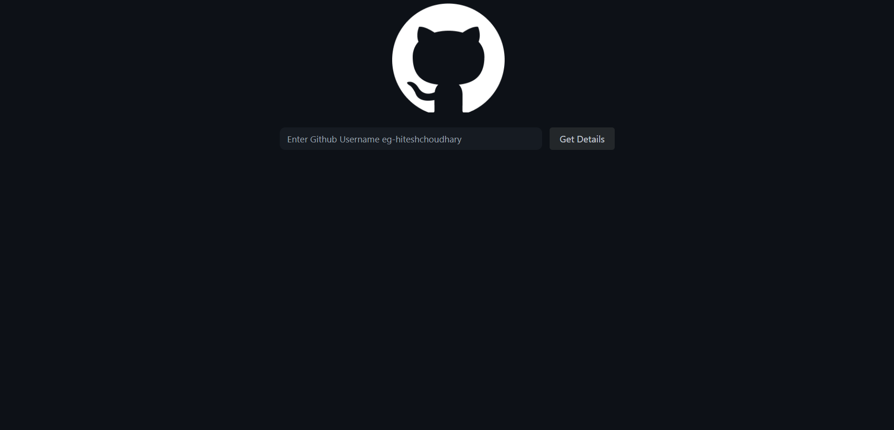
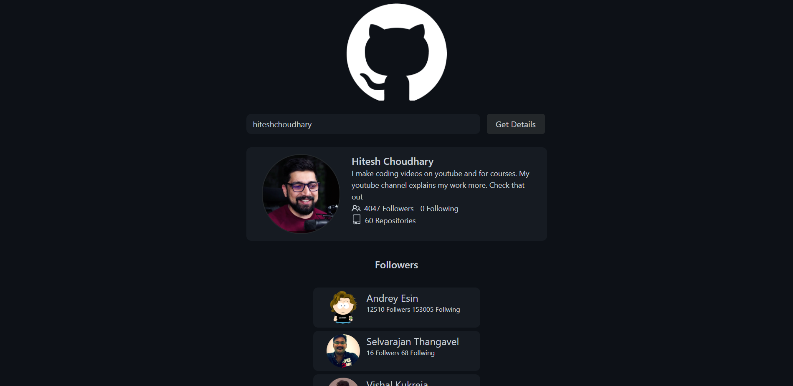
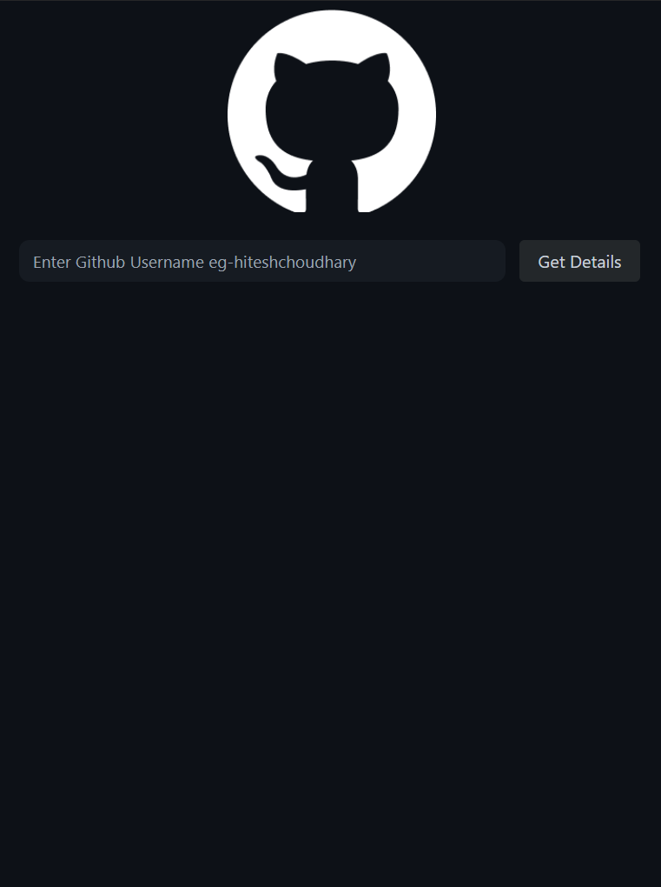
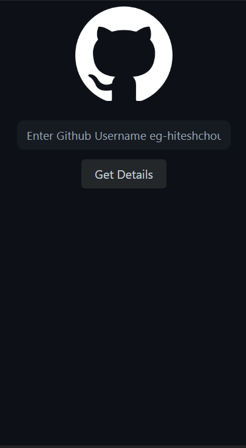
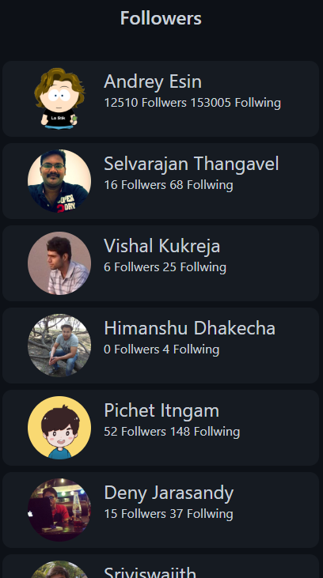

# GIthub-Profile-Vewer [live Link](https://glowing-dusk-731b48.netlify.app/)

**Name:** Yash Kumar

**In this project we have GIT hub API to fetch user data from the server and displays that data on the user screen.**

## Features
**Showing user image**

**Displaying user Profile picture**

**Displaying user followers and following count.**

**Displaying user follwing list (fist 30 count).**

**The project took ***2 Hours*** to complete.** 

# Desktop View

## Home screen

## Output screen

## Tab View

## Home screen

## Output screen

## Mobile View

## Home screen

## Output screen

